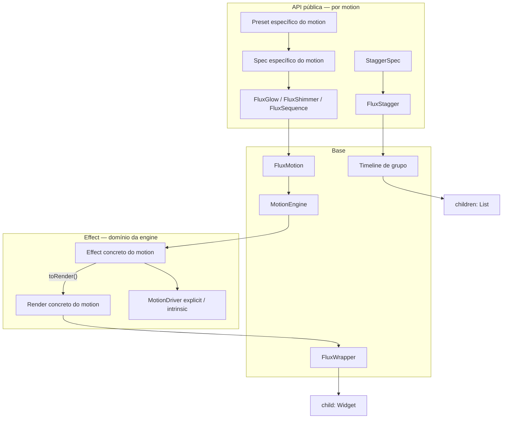

# flutter_flux_motion — Arquitetura

> Documento vivo dos contratos, camadas e decisões de implementação da
> biblioteca.

## Visão

`flutter_flux_motion` é uma **biblioteca Flutter** que fornece componentes de motion para serem usados em qualquer projeto.

Princípio central: uma **engine configurável** que pode ser aplicada **por cima de qualquer `Widget`**, sem exigir que o consumidor substitua seus widgets existentes.

```dart
FluxGlow(
  spec: GlowPreset.neon(),
  child: Icon(Icons.star),
)
```

---

## Objetivos

| Objetivo | Descrição |
|----------|-----------|
| Wrapper composable | Envolver qualquer `child`, não criar widgets paralelos |
| Engine abstrata | Orquestração e lifecycle isolados da lógica visual |
| Presets por motion | Cada tipo de animação tem seus próprios presets |
| Pipeline de render | Wrapper sem condicionais por tipo de efeito |
| Performance | Disposes corretos, sem vazamento de controllers/listeners |
| Acessibilidade | Respeitar `MediaQuery.disableAnimationsOf` |

---

## Hierarquia de camadas

```
Engine (abstrata)
  └── FluxMotion (widget base)
        └── [Módulo concreto] Preset + Component + Effect + Render
              └── FluxWrapper (pipeline)
                    └── child: Widget

Timeline de grupo
  └── FluxStagger + StaggerSpec
        └── janelas de fade/offset por child
```

### Fluxo em runtime

1. Componente concreto (`FluxGlow`, `FluxShake`, …) monta com preset ou spec customizada.
2. `FluxMotion` instancia a **engine** e registra a lista de **effects**.
3. Engine faz `attach` → `play` → `tick` → `dispose`.
4. A cada frame, cada effect produz um **`MotionRender`** via `toRender()`.
5. `FluxWrapper` recebe a lista na ordem e aplica com **`fold`** (sem `if` por tipo).
6. O `child` original é renderizado com o pipeline aplicado.
7. `FluxStagger` é o orquestrador de grupo: mantém uma timeline única e calcula
   janelas locais para cada child, sem criar uma engine ou controller por item.



---

## Responsabilidades por camada

### MotionEngine (abstrata)

Núcleo da lib. **Não conhece** glow, shimmer, fade, etc.

Responsável por:

- Orquestrar cada camada
- Gerenciar ciclo de vida (`attach`, `play`, `stop`, `dispose`)
- Coordenar `AnimationController` e listeners
- Produzir `List<MotionRender>` na ordem dos effects
- Respeitar animações desabilitadas pelo sistema

Não responsável por:

- Aplicar transformações visuais no widget tree
- Definir presets ou parâmetros de efeitos específicos

```dart
abstract class MotionEngine {
  void bind(List<MotionEffect> effects, TickerProvider vsync);
  void start(MotionTrigger trigger);
  void stop();
  void dispose();

  List<MotionRender> buildPipeline();
}
```

---

### FluxMotion (widget base)

Ponto de entrada da engine no widget tree.

Responsável por:

- Receber `child` + lista de effects
- Instanciar e conectar a engine no `State`
- Repassar pipeline para `FluxWrapper` a cada rebuild

Componentes concretos **estendem** `FluxMotion` — não duplicam lógica de engine.

```dart
abstract class FluxMotion extends StatefulWidget {
  const FluxMotion({
    super.key,
    required this.child,
    required this.effects,
    this.trigger = MotionTrigger.onMount,
  });

  final Widget child;
  final List<MotionEffect> effects;
  final MotionTrigger trigger;
}
```

---

### MotionEffect (domínio da engine)

Unidade de animação configurável. Vive na engine, mas cada implementação concreta fica no **módulo do motion**.

Responsável por:

- Receber spec imutável (parâmetros de personalização)
- Animar valores ao longo do tempo (`tick`)
- Declarar driver preferido (explicit vs intrinsic)
- Converter estado atual em `MotionRender` via `toRender()`

```dart
abstract class MotionEffect {
  Duration get duration;
  Curve get curve;
  MotionDriver get preferredDriver;

  void attach(MotionContext context);
  void play({required MotionTrigger trigger});
  void tick(Duration elapsed);
  void dispose();

  MotionRender toRender();
}
```

---

### MotionRender

Aplicação visual **sem lógica de animação**. O wrapper só chama `build`.

```dart
abstract class MotionRender {
  Widget build(Widget child);
}
```

Implementações usam o que fizer sentido: `Opacity`, `Transform`, `DecoratedBox`, `ShaderMask`, `CustomPainter`, etc.

---

### FluxWrapper (pipeline)

Widget **burro**: não sabe qual effect foi aplicado, apenas **respeita a ordem**.

```dart
class FluxWrapper extends StatelessWidget {
  const FluxWrapper({
    super.key,
    required this.child,
    required this.pipeline,
  });

  final Widget child;
  final List<MotionRender> pipeline;

  @override
  Widget build(BuildContext context) {
    return pipeline.fold<Widget>(
      child,
      (current, render) => render.build(current),
    );
  }
}
```

**Regra:** nenhum `if (effect is Glow)` no wrapper. Condicionais ficam nas classes concretas de render.

---

### Presets (por motion, não global)

Preset **não é widget**. Não existe um `FluxPreset` monolítico com todos os efeitos.

Cada motion tem seu próprio preset, co-locado com effect e componente:

```
motions/glow/glow_preset.dart   → GlowPreset.neon(), .soft(), .pulse()
motions/shimmer/shimmer_preset.dart → ShimmerPreset.skeleton(), .accent()
motions/shake/shake_preset.dart → ShakePreset.error(), .attention(), .vertical()
motions/pulse/pulse_preset.dart → PulsePreset.emphasis(), .tap(), .status()
motions/bounce/bounce_preset.dart → BouncePreset.success(), .notification(), .playful()
```

Presets montam `Spec` ou `List<Effect>` **apenas daquele motion**.

---

### Components (extensão de FluxMotion)

Atalhos ergonômicos para o consumidor. Cada componente pertence a um módulo:

```dart
class FluxGlow extends FluxMotion {
  FluxGlow({
    super.key,
    required super.child,
    GlowSpec? spec,
    List<GlowEffect>? effects,
  }) : super(
          effects: effects ?? [GlowEffect(spec ?? GlowPreset.soft())],
        );
}
```

---

### MotionDriver (classe auxiliar)

Centraliza animações **explicit** vs **intrinsic**.

| Driver | Quando usar |
|--------|-------------|
| **explicit** | `AnimationController` — triggers custom, loop, sequência, shimmer |
| **intrinsic** | `TweenAnimationBuilder`, widgets implícitos — toggles simples |

A engine escolhe com base em `effect.preferredDriver`.

### FluxMotionController

Controle imperativo opcional para os componentes `Flux*`. Expõe apenas intenções
de alto nível — `play`, `stop`, `reset` e `replay` — e não entrega um
`AnimationController` ao consumidor.

O componente mantém a responsabilidade de conectar e desconectar o controller
durante seu lifecycle. Assim, uma mesma intenção de produto pode iniciar uma
sequence ou um stagger sem assumir ticker, listener ou `dispose`.

---

## Effects disponíveis (exemplos)

### Glow

Parâmetros principais:

- Raio do brilho (`radius`)
- Cor do brilho (`color`)
- Intensidade (`intensity`)
- Duração (`duration`)
- Curva (`curve`)
- Trigger (`onMount`, `onHover`, loop, …)

Render típico: `BoxShadow` via `DecoratedBox`.

### Shimmer

Parâmetros principais:

- Cores fora e dentro do feixe (`baseColor`, `highlightColor`)
- Intensidade e largura relativa (`intensity`, `bandWidth`)
- Direção (`ShimmerDirection`)
- Duração e curva (`duration`, `curve`)
- Repetição e alternância (`repeat`, `reverse`)

Render típico: `ShaderMask` ou `CustomPainter`.

### Motions de feedback

- `Shake` oscila no eixo definido por `ShakeAxis` e sempre retorna ao repouso.
- `Pulse` percorre um ciclo de escala e pode manter um status em repetição.
- `Bounce` desloca na direção definida por `BounceDirection` e acomoda o child
  com movimentos progressivamente menores.

Os três compartilham a mesma engine, os mesmos triggers e a mesma regra de
acessibilidade dos motions essenciais.

### Orquestração

- `FluxSequence` executa `MotionSequenceStep` na ordem definida por
  `SequenceSpec.steps`. Cada etapa encapsula um effect público existente e a
  timeline pode repetir ou alternar o sentido.
- `FluxStagger` coordena um grupo de widgets. `StaggerSpec.interval` desloca o
  início de cada item, enquanto duração, curva, offset, opacidade e ordem
  permanecem declarativos.
- `FluxMotionController` oferece controle externo opcional sem alterar a
  propriedade do lifecycle e dos tickers.

---

## Estrutura de pacote

```
flutter_flux_motion/
├── docs/
│   ├── ARCHITECTURE.md
│   └── OVERVIEW.md
├── lib/
│   ├── flutter_flux_motion.dart # exports públicos
│   ├── core/
│   │   ├── engine/
│   │   ├── drivers/
│   │   ├── effects/
│   │   └── widgets/
│   ├── motions/
│   │   ├── fade/ … rotate/
│   │   ├── blur/ … shimmer/
│   │   └── shake/ … bounce/
│   └── orchestration/
│       ├── sequence/
│       └── stagger/
└── example/
    └── lib/catalog/             # uma página pública por motion
```

---

## Triggers disponíveis

| Trigger | Comportamento |
|---------|---------------|
| `onMount` | Dispara ao montar o widget |
| `onTap` / `onTapDown` / `onTapUp` | Interação de toque |
| `onHover` | Hover (desktop/web) |
| `onScroll` | Ligado a scroll (requer controller/notification) |
| `onVisibility` | Após o primeiro frame/layout do componente (hook base sem dependência externa) |

---

## Composição de effects

Ordem da lista = ordem do pipeline no `FluxWrapper`.

Composição possível de duas formas:

1. **Lista manual** — `[GlowEffect(...), ShimmerEffect(...)]`
2. **Preset composto** — ex.: `FadeSlidePreset.entrance()` reutiliza effects de módulos existentes

Para composição temporal, `FluxSequence` agrupa effects em etapas ordenadas.
Para composição espacial de um grupo, `FluxStagger` preserva o mesmo motion em
cada item e desloca seus instantes de início.

---

## Regras de design acordadas

1. **Wrapper nunca interpreta tipo de effect** — apenas `fold` na ordem.
2. **Engine nunca renderiza** — só orquestra e faz dispose.
3. **Preset é dado, component é ergonomia** — sem lógica duplicada.
4. **Cada motion é um módulo fechado** — spec, effect, render, preset, component juntos.
5. **Effect pertence ao domínio da engine** — lifecycle e animação; render é separado.
6. **Polimorfismo sobre condicionais** — `toRender()` substitui cadeias de `if/else`.
7. **Child não é recriado a cada frame** — rebuild afeta pipeline, não o subtree estável do `child`.

---

## Evolução planejada

1. Otimizar timelines longas, listas extensas e reconstruções por frame.
2. Ampliar presets e motions mobile conforme cenários reais forem validados.
3. Evoluir observabilidade, benchmarks e ferramentas de inspeção do catálogo.

---

## Estado atual do repositório

- Package Flutter com engine, drivers, effects e pipeline implementados.
- Componentes públicos: `FluxFade`, `FluxSlide`, `FluxScale`, `FluxRotate`,
  `FluxBlur`, `FluxGlow`, `FluxShimmer`, `FluxShake`, `FluxPulse` e
  `FluxBounce`, além dos orquestradores `FluxSequence` e `FluxStagger`.
- Controle imperativo opcional por `FluxMotionController` com `play`, `stop`,
  `reset` e `replay`.
- Triggers mobile e acessibilidade por `MediaQuery.disableAnimations`.
- Catálogo web responsivo com um arquivo de documentação por componente.
- Testes de unidade e widget cobrindo engine e motions.

---

## Referências de conversa

Decisões registradas neste checkpoint:

- Engine totalmente abstrata, responsável por chamar camadas e disposes.
- Camada concreta separada: components + presets por motion.
- Wrapper recebe pipeline ordenado, sem conhecimento do effect aplicado.
- Effects como entidades da engine (Glow, Shimmer, …) com specs personalizáveis.
- Driver auxiliar para animações explicit vs intrinsic.

## Estado de implementação

O núcleo descrito neste documento e os motions públicos estão implementados,
exportados pela API pública e cobertos por testes de comportamento real. Cada
motion mantém o mesmo contrato de spec, effect, render, componente e
documentação visual; os módulos com cenários recorrentes também expõem presets.
